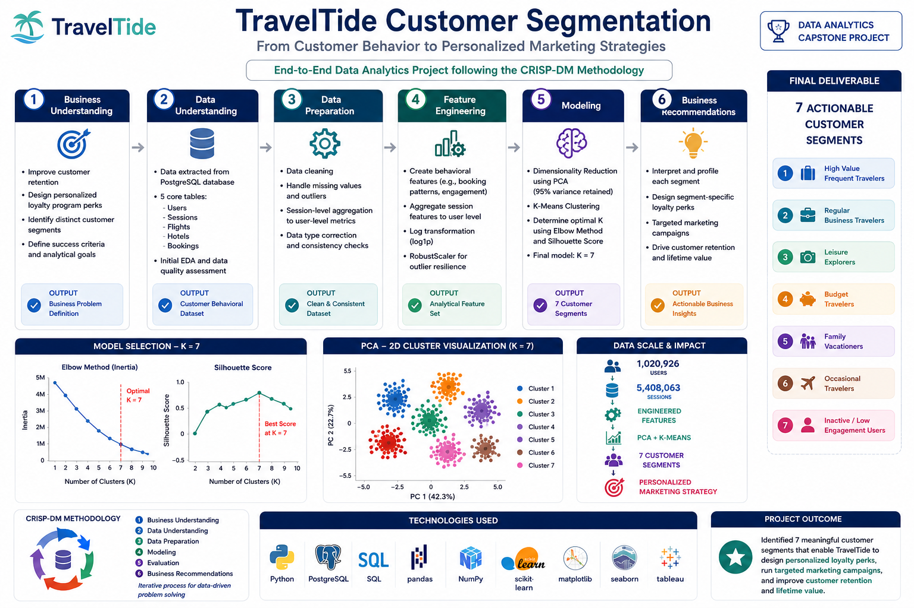

# 🌍 TravelTide Customer Segmentation

### Customer Analytics | Customer Segmentation | Machine Learning | CRISP-DM

An end-to-end customer segmentation project that applies the CRISP-DM methodology to analyze customer behavior, identify meaningful traveler segments, and develop data-driven reward strategies for a personalized loyalty program.

---

# ⭐ Project Highlights

✔ End-to-end customer segmentation using the CRISP-DM framework

✔ Advanced feature engineering from relational customer, flight, hotel, and session data

✔ Customer segmentation using PCA and K-Means clustering

✔ Cluster evaluation through silhouette analysis and business interpretability

✔ Data-driven reward strategy aligned with customer behavior

✔ Executive summary and stakeholder presentation with actionable business recommendations

---

# 📖 Project Overview

TravelTide is an online travel platform seeking to improve customer retention through a personalized rewards program. Rather than offering identical incentives to all users, the objective is to understand differences in customer behavior and design targeted rewards that maximize engagement and long-term loyalty.

This project develops an end-to-end customer segmentation workflow by integrating customer, session, flight, and hotel data to uncover meaningful behavioral patterns. Through comprehensive feature engineering, dimensionality reduction, and unsupervised machine learning, customers are grouped into distinct segments that support data-driven marketing decisions.

The final segmentation identifies seven actionable customer groups, each mapped to a tailored reward strategy based on travel preferences, booking behavior, spending patterns, and engagement characteristics. The project concludes with executive-level recommendations designed to support marketing strategy and customer retention initiatives.

---

# 🎯 Business Objective

The primary objectives of this project are to:

- Understand customer travel behavior and booking preferences.
- Identify meaningful customer segments using data-driven methods.
- Design targeted reward strategies for each customer segment.
- Deliver actionable business recommendations to improve customer retention, engagement, and loyalty.

---
## 🔄 End-to-End Project Workflow

<p align="center">
    
</p>

<p align="center">
<b>Figure 1.</b> End-to-end analytics workflow illustrating the CRISP-DM process from business understanding and data preparation through feature engineering, customer segmentation, model evaluation, and actionable business recommendations.
</p>

---

## ⚙️ Methodology (CRISP-DM)
1. **Business Understanding** – Align segmentation with TravelTide’s rewards program strategy.  
2. **Data Understanding** – Explore relational database (users, sessions, flights, hotels). Identify anomalies (duplicate sessions, invalid hotel nights).  
3. **Data Preparation** – Clean and filter data, define user cohorts, handle outliers, scale features.  
4. **Feature Engineering** – Derive behavioral metrics (rebooking ratio, co-booking ratio, dollars saved per km, etc.), aggregated at the **user level**.  
5. **Modeling (Customer Segmentation)** – Apply **KMeans clustering** with PCA. Iterated across multiple values of `k`. Evaluated with **silhouette scores** and interpretability.  
6. **Evaluation** – Validate clusters against hypothesized perk behaviors. Ensure alignment with marketing strategy.  
7. **Deployment (Communication)** – Deliver **executive summary** and **stakeholder slide deck** with visuals (heatmaps, radar charts).

---

## 📊 Key Findings
- Identified **7 distinct customer segments** (Iteration 4, k=7).  
- Segments showed clear differences in **spend, booking type, rebooking, discount sensitivity, and engagement**.  
- Each segment was assigned a **personalized perk** (e.g., *Free Checked Bag*, *No Cancellation Fees*, *Exclusive Discounts*).  
- Results validated some of Elena’s hypotheses while also surfacing **new behavioral patterns**.  

---

## 🎁 Perk Mapping (Final Segments)
| Cluster | Segment Name                          | Assigned Perk                          |
|---------|---------------------------------------|-----------------------------------------|
| 0       | Deal-Seeking Co-Bookers               | 💰 Exclusive Discounts                  |
| 1       | Inactive / Idle Users                 | 🥘 Free Hotel Meal                      |
| 2       | Affluent Hotel Travelers              | 🥞 Complimentary Daily Breakfast        |
| 3       | Family Leisure Vacationers (Hotel-Only) | 🧼 Free Mid-Stay Housekeeping          |
| 4       | Rebooking-Prone Solo Fliers           | ❌ No Cancellation Fees                 |
| 5       | Loyal High-Value Travelers            | ✈️ 1 Night Free Hotel + Flight          |
| 6       | Stable Frequent Fliers                | 🧳 Free Checked Bag                     |

---

## 📑 Project Deliverables

This repository includes the key business and analytical deliverables produced throughout the customer segmentation project.

- 📄 **Executive Summary**  
  High-level summary of the project, methodology, key findings, and business recommendations.  
  → [Executive Summary](reports/Executive_Summary.pdf)

- 📊 **Stakeholder Presentation**  
  Executive presentation summarizing the customer segmentation workflow, insights, and proposed loyalty strategy.  
  → [Stakeholder Presentation](reports/Stakeholder_Presentation.pptx)

- 📈 **Cluster Profiling Summary**  
  Final profiling of all customer segments, including behavioral characteristics and assigned reward recommendations.  
  → [cluster_summary_k7_iter4.csv](output/cluster_summary_k7_iter4.csv)

- 🗂️ **Final Feature Dataset with Cluster Labels**  
  Final analytical dataset containing engineered features and customer segment assignments used for analysis and visualization.  
  → [df_true_cluster_k7_iter4.csv](output/df_true_cluster_k7_iter4.csv)

---

## 🚀 Future Improvements
- Track **segment performance** after perks rollout.  
- Re-cluster periodically as new data accumulates.  
- Explore additional **personalization strategies** (dynamic perks, hybrid offers).  

---

# 📂 Repository Structure

```text
TravelTide-Customer-Segmentation/
│
├── data/
│   ├── Raw/
│   │   └── Raw extracted datasets
│   │
│   └── Processed/
│       └── Cleaned and feature-engineered datasets
│
├── notebooks/
│   └── Customer_Segmentation_Analysis.ipynb
│
├── output/
│   ├── Cluster profiling summaries
│   ├── PCA visualizations
│   ├── Heatmaps
│   └── Final clustered datasets
│
├── reports/
│   ├── Executive Summary
│   └── Stakeholder Presentation
│
├── images/
│   └── traveltide_workflow.png
│
├── README.md
└── requirements.txt
```

The repository is organized to clearly separate raw and processed data, analytical notebooks, visual outputs, business deliverables, and supporting documentation. This structure promotes reproducibility while making the complete analytics workflow easy to navigate.

---

# 🛠️ Tools & Technologies

| Category | Technologies |
|-----------|--------------|
| **Programming Language** | Python |
| **Database** | PostgreSQL |
| **Data Processing** | Pandas, NumPy |
| **Machine Learning** | Scikit-learn, PCA, K-Means Clustering |
| **Data Visualization** | Matplotlib, Seaborn |
| **Analytics Methodology** | CRISP-DM, Feature Engineering, Silhouette Analysis |
| **Development Environment** | Jupyter Notebook / Google Colab |
| **Documentation & Reporting** | Microsoft PowerPoint, Microsoft Word, GitHub Markdown |

---

# 👤 Author

## Abhinay Dornipati

**Data Analytics | Machine Learning | Python**

Data Analytics and Machine Learning professional with an engineering background and over six years of experience in computational modeling, automation, and analytical problem-solving. Passionate about transforming data into actionable insights through data analytics, machine learning, statistical analysis, and data visualization.

This repository is part of my professional portfolio, showcasing end-to-end data analytics and machine learning projects built using reproducible workflows and industry best practices.  
